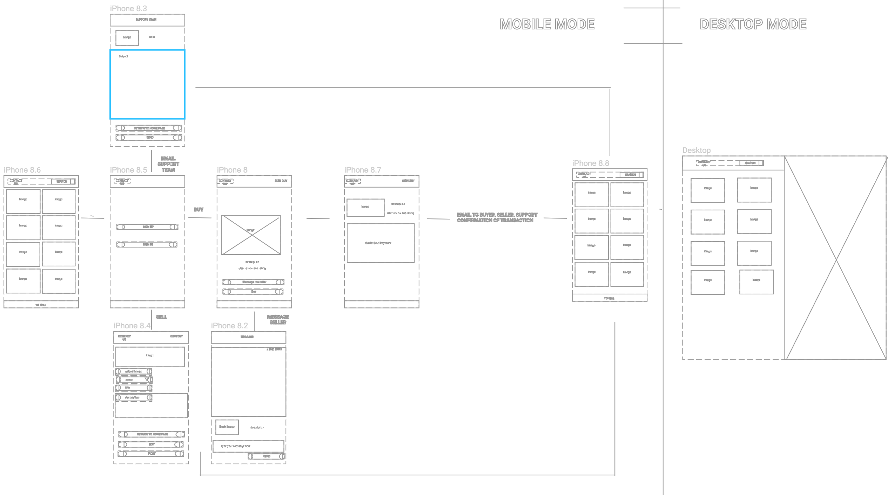
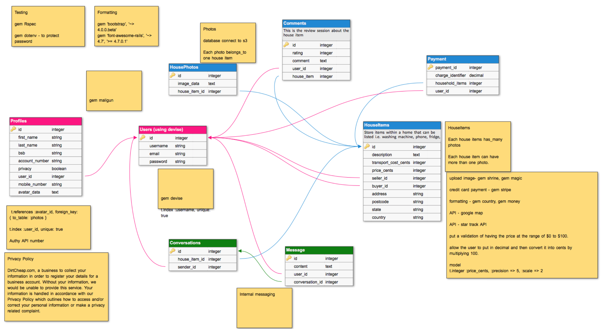

# PROJECT NAME : DIRTCHEAP.COM
- objective : To recycle at a relatively low price of good condition household item (aged not more than 6 years) within 3 days

#### Model : User 
email: string
password: string
username: string

*making sure no duplicate records are detected for username and email*

> validates :email, username, presence: true, uniqueness: { case_sensitive: false }
> validates :username, length: { minimum: 4 }

*set up password complexity requirements*
> validate :password_complexity
>    def password_complexity
>        if password.present?
>            if !password.match(/^(?=.*[a-z])(?=.*[A-Z])(?=.*\W)(?=.*\d)/) 
>                errors.add :password, "Password must contain at least an uppercase, a lowercase, a symbol and a digit requirements"
>            end
>        end
>    end
source : https://gist.github.com/pmarreck/4c5f1076498da1a86062

has_one :profile

- add username to devise/user model and to create a unique constraint on users.email by assigning an index. This is like keys in a hash (source : https://robots.thoughtbot.com/the-perils-of-uniqueness-validations)

$ rails generate migration AddUsernameToUser username:string:uniq

#### Model : Profile

- first_name: string            
- last_name: string
- bsb: string                   ==> as string as some number starts with 0
- account_number: string        ==> as string as some number starts with 0
- mobile_number: string         ==> as string as some number starts with 0
- privacy: boolean
- avatar: text                  ==> gem Shrine works well with text rather than string
- user: references

$ rails g scaffold Profile first_name last_name bsb account_number privacy:boolean avatar:text user:references

*making sure only one user_id / avatar_id is tagged to the User table / Photo table*
> t.index : avatar, unique: true   this is to create an id for every avatar. This allows faster searching process. This is not needed.

*making sure only one mobile number per user*
> validates :mobile_number, unique: true, presence: true

> validates :first_name. :last_name, : presence: true

*making sure the privacy statement is acknowledged and agreed*
>validates :boolean_field_name, inclusion: { in: [true, false] }

belongs_to :user

#### Model : House Item

- year_purchase: integer           
- description: text
- street_name: string
- postcode: string                  ==> as string as some number starts with 0
- state: string                     ==> 
- country: string                   ==> gem country_select to display country name and stored as country code
- transport_cost_cents: integer     ==> multiply by 100 and then convert the variable to integer in the model
- price_cents: integer              ==> multiply by 100 and then convert the variable to integer in the model
- item_image: references
- seller: references
- buyer: references

> validates :year_purchased, presence: true, numericality: { only_integer: true, greater_than: 2011 }\
> validates :description, :street_name, :postcode, :state, :country_code, presence: true \
> validates :description, length: { maximum: 500, too_long: "%{count} characters are the maximum allowed"} \
> validates :price_cents, :transport_cost_cents numericality: { greater_than_or_equal_to: 0 }

belongs_to :item_image, class_name: 'Photo'
belongs_to :seller, class_name: 'User'
belongs_to :buyer, class_name: 'User'

#### Model : Photo
- image: string

> validates :avatar, presence: true

has_many: house_items, dependent: :destroy
has_many: avatars, dependent: :destroy

#### Model : Review
- rating: integer               max of 5 thumb up
- comment: text
- user: references
- house_item: references

> validates :rating, numericality: { greater_than_or_equal_to: 0, less_than: 6}\
> validates :comment, length: { maximum: 500, too_long: "%{count} characters are the maximum allowed"}

belongs_to :user
belongs_to :house_item

### **Internal Messaging**
#### Model : Message
- content: text
- sender: references

> validates :content, length: { maximum: 500, too_long: "%{count} characters are the maximum allowed"} \

belongs_to :sender, class_name: 'User'

#### Model : Conversation
- house_item: references
- user1: references

belongs_to :house_item
belongs_to :user1, class_name: 'User'

has_many :messages, dependent: :destroy

#### Model : Support
- user: references

belongs_to :user

---

## Work Flow

## Database Diagram

## Wireframes

## Trello Project Management Tool
source : https://trello.com/b/fp4LahXo/good-second-hand-household

---

# CREATE PROJECT AND INITIAL FRAMEWORK SETUP
$ rails new dirtcheap -T --database=postgresql

$ cd dirtcheap

$ rails db:create

# INITIAL SETUP 
## Install Gem to GemFile

- To store private key, password and email \
gem 'dotenv-rails', groups: [:development, :test] 

- User Authenication for login \
gem 'devise'
- User Authorisation access after user login (this is about what the person can access) \
gem "pundit"
- Credit Card Payment \
gem 'stripe'
- Webpage formatting \
gem 'bootstrap', '~> 4.0.0.beta'  \
gem 'font-awesome-rails', '~> 4.7', '>= 4.7.0.1' 
- Email Support \
gem 'mailgun-ruby', '~>1.1.6' \
- Upload Image \
gem 'shrine'
- Resize Image \
gem 'image_processing' \
gem 'mini_magick' \
gem 'fastimage' # for store_dimensions plugin
- Location to communicate with Google Map \
gem 'geocoder'
- Formatting \
gem 'countries' \
gem 'country_select'\
gem 'money-rails'
- To enable reading API information \
gem 'httparty'      ( source: https://github.com/jnunemaker/httparty ) \
- To enable country code by displaying country name
gem 'country_select'
### after this gem group :development, :test do \
- For testing purpose \
gem 'rspec-rails', '~> 3.6'

- state .env in gitignore file
- create .env file to the root of the project
$ touch .env

- and save all the keys (mailgun, authy for two ways tokenisation, twilio for sms)

- > app > assets > stylesheets > application.scss  \
@import 'font-awesome';  \
@import "bootstrap";   \
@import 'reviews';   \
@import 'book_collections';

---